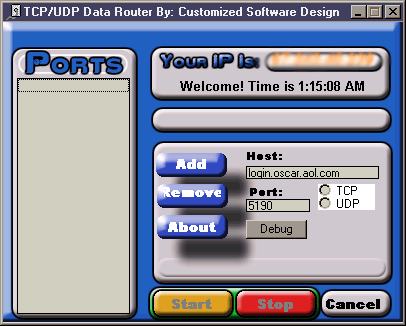

<div align="center">

## TCP Data Router


</div>

### Description

Intercepts and re-routes tcp data to a specified port and server. *updated missing files*
 
### More Info
 


<span>             |<span>
---                |---
**Submitted On**   |2002-09-29 03:23:52
**By**             |[High Tech](https://github.com/Planet-Source-Code/PSCIndex/blob/master/ByAuthor/high-tech.md)
**Level**          |Intermediate
**User Rating**    |3.7 (11 globes from 3 users)
**Compatibility**  |VB 5\.0, VB 6\.0
**Category**       |[Complete Applications](https://github.com/Planet-Source-Code/PSCIndex/blob/master/ByCategory/complete-applications__1-27.md)
**World**          |[Visual Basic](https://github.com/Planet-Source-Code/PSCIndex/blob/master/ByWorld/visual-basic.md)
**Archive File**   |[TCP\_Data\_R1379199292002\.zip](https://github.com/Planet-Source-Code/high-tech-tcp-data-router__1-39359/archive/master.zip)

### API Declarations

```
if you like the code, or even if you dont:
visit http://customsoftware.cjb.net
or http://heyyouvisitme.cjb.net
any visits would be greatly appreciated
aim sn is telnetguru
thanks, have a good day =)
```


